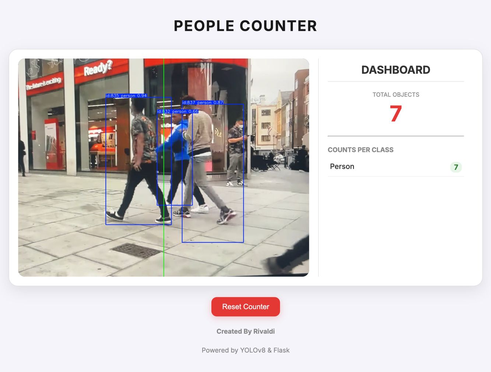

\<h1 align="center"\>👁️🚶‍♂️📊 Real-Time Object Counter\</h1\>
\<p align="center"\>Sistem deteksi dan penghitung objek \<i\>real-time\</i\> berbasis YOLOv8 + Flask, dengan dashboard interaktif yang bisa dikustomisasi.\</p\>

\<p align="center"\>
\
\
\
\
\
\
\</p\>

\<p align="center"\>
\
\</p\>

-----

## ✨ Fitur Utama

✅ Deteksi objek *real-time* menggunakan YOLOv8m.  
✅ **Filter Kategori Objek:** Pilih untuk mendeteksi Manusia, Hewan, atau Benda.  
✅ **Garis Hitung Kustom:** Gambar garis hitung sendiri langsung di browser.  
✅ Video streaming langsung ke browser menggunakan Flask.  
✅ Penghitungan satu arah dengan logika *line crossing*.  
✅ Dashboard interaktif tanpa perlu *refresh* (fetch API).  
✅ Reset counter instan.  
✅ Logging data ke file `.csv` untuk analisis lanjutan.

-----

## changelog-pembaruan-terbaru"\>📜 Changelog Pembaruan Terbaru

  * **Fitur Filter Objek:** Menambahkan *checkbox* di UI untuk memilih kategori objek yang ingin dideteksi (manusia, hewan, benda). Backend kini dapat secara dinamis mengubah kelas yang dilacak oleh model YOLO.
  * **Fitur Garis Hitung Kustom:** Mengimplementasikan elemen `<canvas>` di atas video feed, memungkinkan pengguna untuk menggambar garis hitung mereka sendiri menggunakan mouse. Koordinat garis dikirim ke backend untuk digunakan dalam logika deteksi.
  * **Peningkatan Arsitektur:** Memisahkan logika tampilan (frontend) dan pemrosesan data (backend) untuk fitur-fitur baru, memastikan kode tetap bersih dan modular.

-----

## 🛠️ Teknologi yang Digunakan

  * **Backend:** Python, Flask, OpenCV, PyTorch, Ultralytics YOLOv8
  * **Frontend:** HTML5, CSS3, JavaScript (vanilla)
  * **Concurrency:** Python `threading.Lock` untuk menghindari *race condition*.

-----

## 🚀 Cara Instalasi

```bash
# 1. Clone repo ini
git clone https://github.com/rivaldikaufman/PEOPLE-COUNTER.git
cd PEOPLE-COUNTER

# 2. Buat virtual environment
python3 -m venv venv

# 3. Aktifkan (macOS/Linux)
source venv/bin/activate

# 4. Install dependencies
pip install -r requirements.txt
```

💡 *Catatan:* File model `.pt` akan otomatis diunduh saat pertama kali dijalankan.

-----

## ▶️ Jalankan Aplikasi

```bash
python main_web.py
```

Lalu buka browser ke alamat: [http://127.0.0.1:5001](http://127.0.0.1:5001)

-----

## 🐞 Studi Kasus & Solusi Teknis (FIXED)

Selama pengembangan, ada beberapa tantangan menarik yang berhasil diatasi:

### Kasus 1: Server Crash saat Tombol Reset Diklik (500 Error)

  * **Masalah:** Aplikasi mengalami *500 Internal Server Error* setiap kali tombol "Reset Counter" diklik saat video sedang berjalan.
  * **Diagnosis:** Terjadi **Race Condition**. Fungsi *video streaming* (`generate_frames`) terus-menerus membaca data counter, sementara di saat yang sama fungsi `reset_counter` mencoba menghapus total data tersebut. Perebutan akses ini menyebabkan crash.
  * **Solusi:** Mengimplementasikan **`threading.Lock()`**. Sebuah "kunci" dibuat untuk data counter. Baik fungsi *streaming* maupun fungsi *reset* harus "memegang kunci" ini sebelum bisa mengakses data. Ini memastikan hanya satu proses yang bisa memodifikasi data pada satu waktu, sehingga mencegah "tabrakan".

### Kasus 2: Tampilan Dashboard Terpotong atau "Tenggelam"

  * **Masalah:** Panel dashboard di sisi kanan tidak tampil sepenuhnya atau terpotong.
  * **Diagnosis:** Properti CSS **`object-fit: cover`** pada tag `` video memaksa gambar (yang lebih lebar karena sudah digabung dengan dashboard oleh OpenCV) untuk memenuhi wadahnya dengan cara di-zoom dan dipotong, sehingga bagian kanan (dashboard) hilang.
  * **Solusi:** Mengubah arsitektur. Dashboard tidak lagi digambar oleh OpenCV. Backend hanya menyediakan API data (`/get_counts`), dan frontend (HTML/CSS/JS) membuat layout-nya sendiri dan mengambil data secara berkala. Ini memisahkan logika tampilan dan data, menghasilkan solusi yang lebih bersih dan modern.

### Kasus 3: `TypeError` di Mac M2 saat Kalkulasi

  * **Masalah:** Saat versi awal (desktop) dikembangkan, terjadi `TypeError` saat melakukan operasi matematika.
  * **Diagnosis:** Library **NumPy** tidak bisa secara langsung memproses data **PyTorch Tensor** yang berada di memori GPU Mac M2 (MPS device).
  * **Solusi:** Memindahkan data tensor dari GPU ke CPU terlebih dahulu sebelum diubah menjadi format NumPy. Ini dilakukan dengan menambahkan method `.cpu()` pada data tensor yang relevan.

-----

## 👨‍💻 Dibuat Oleh

**Rivaldi**
📫 DM via [Threads](https://www.threads.net/@awpetrik)

-----

> ⭐ Star repo ini kalau bermanfaat\!
> 👀 Feedback & issue? Jangan ragu buka *Issue tab* di atas.